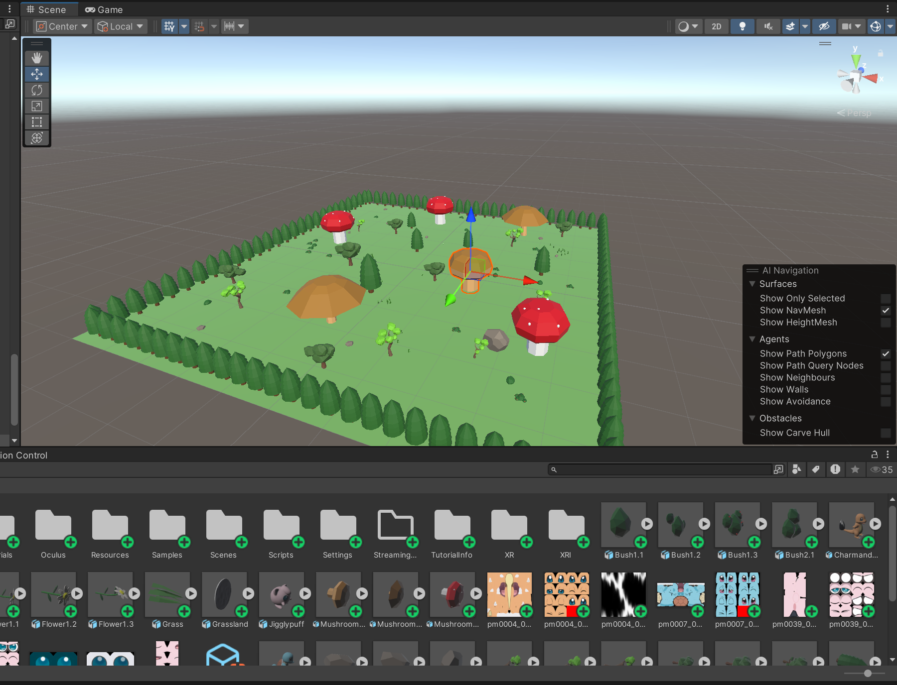
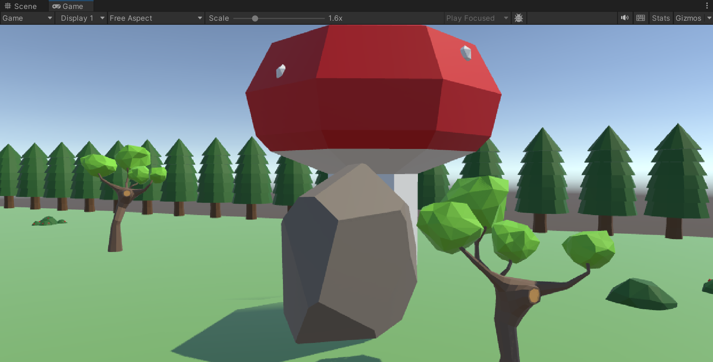
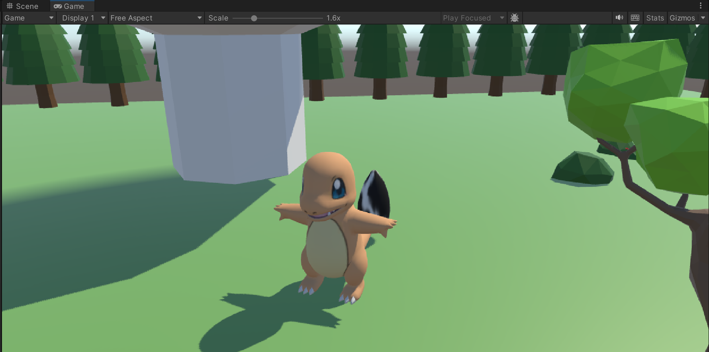
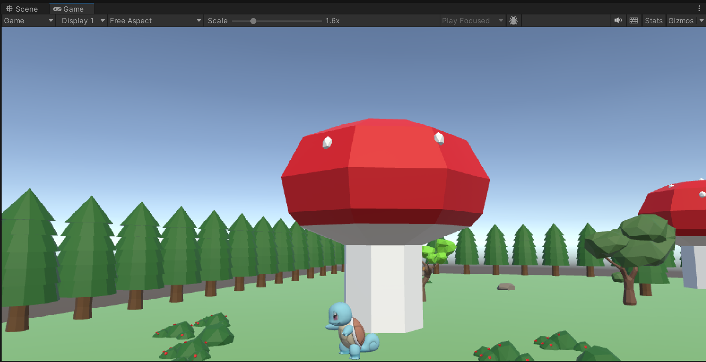
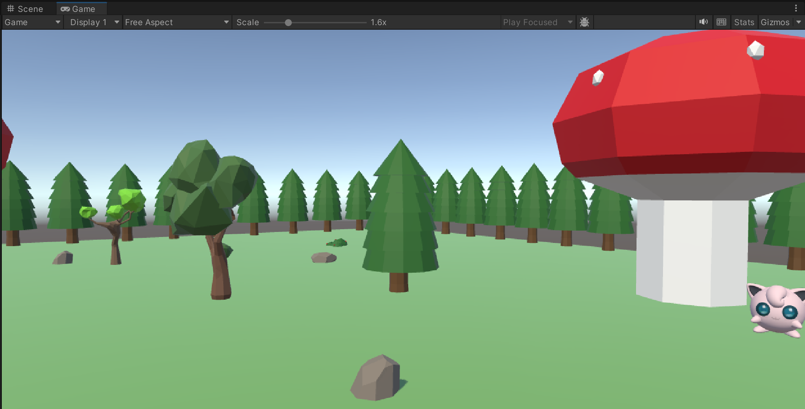

# PokeVisionVR

Perception-Based Pokémon Discovery in Virtual Reality

PokeVisionVR is a VR exploration experience developed in Unity for the Meta Quest 3. Instead of relying on traditional controller interactions, the project uses physical movement, head orientation, and peripheral vision as core gameplay mechanics for discovering hidden Pokémon throughout a virtual environment.

## Demo
[Project Report](https://drive.google.com/file/d/1up2KuB6sM5LCSq6d1lWd46dRlgMTUx0n/view?usp=sharing)

[Project Poster](https://drive.google.com/file/d/1TTwXw6L7JVS0-t0T0gq_kyCI3jkru1ax/view?usp=sharing)

[Quest Gameplay Demo](https://www.youtube.com/watch?v=v35lmPcKBQY)

[Unity Gameplay Demo](https://www.youtube.com/watch?v=T32IbaHQagw)

---

## Overview

Inspired by the feeling of searching for hidden creatures in games like Pokémon Snap, PokeVisionVR explores how perception itself can become a gameplay mechanic in virtual reality.

Players navigate a stylized forest environment where different Pokémon are revealed only when specific perceptual conditions are met. Rather than pressing buttons, players must physically move, look upward, and use peripheral vision to uncover hidden discoveries.

---

## Game Environment

The experience takes place in a low-poly forest environment designed for exploration and discovery. Trees, rocks, mushrooms, and hidden Pokémon encourage players to investigate the world using natural movement and observation.

---

## Core Mechanics

### Charmander — Distance-Based Discovery

Charmander begins disguised as a rock hidden within the environment. The system continuously measures the distance between the player and the object. When the player enters a predefined radius, the rock disappears and Charmander is revealed.

| Before | After |
|---------|--------|
|  |  |

**Technical Concepts**
- Positional tracking
- Euclidean distance calculations
- World-space coordinate systems
- Dynamic object replacement

---

### Squirtle — Orientation-Based Discovery

Squirtle is hidden beneath a giant mushroom and can only be discovered when the player physically approaches the area and looks upward. This interaction encourages players to use natural head movement rather than relying solely on controller input.

**Technical Concepts**
- Head orientation tracking
- Forward vectors
- Distance thresholds
- View-direction detection

---

### Jigglypuff — Peripheral Vision Discovery

Jigglypuff implements the most complex interaction in the project. Instead of appearing directly in front of the player, visibility is based on peripheral vision. The Pokémon becomes noticeable near the edges of the player's field of view and disappears when looked at directly.

**Technical Concepts**
- Dot products
- Direction vectors
- Peripheral visibility weighting
- Continuous visibility functions

---

## Technical Stack

| Component | Technology |
|------------|------------|
| Engine | Unity 2022.3.62f3 |
| VR Headset | Meta Quest 3 |
| XR Framework | OpenXR |
| Interaction System | XR Interaction Toolkit |
| Language | C# |
| Rendering Pipeline | Universal Render Pipeline (URP) |

---

## Core Systems

The project uses real-time headset tracking to create perception-driven interactions:

- Positional tracking
- Head orientation tracking
- Peripheral visibility detection
- Distance calculations
- Vector mathematics
- Dynamic object reveal systems

---

## Results

The final experience successfully demonstrated three distinct perception-based interaction systems:

- Charmander encourages spatial exploration through movement.
- Squirtle encourages upward gaze and environmental awareness.
- Jigglypuff encourages peripheral observation and viewpoint-dependent discovery.

The project demonstrates how relatively lightweight mathematical systems can create engaging VR interactions without requiring complex AI or physics systems.

---

## Future Directions

Future versions of PokeVisionVR could incorporate:

- Hand tracking
- Gesture-based interaction
- Spatial audio cues
- Multiplayer exploration
- Dynamic shader effects
- Adaptive AI behaviors
- More complex environmental interactions

---

## Acknowledgments

Created as the final project for **EE267: Virtual Reality** at Stanford University.

---

## References

1. Unity XR Interaction Toolkit Documentation
2. David et al., *The Importance of Peripheral Vision When Searching 3D Real Environments* (2021)
3. Lehrman et al., *Embodied Learning Through Immersive Virtual Reality* (2025)
4. Katzourin & Hudson, *Effects of Distance Perception in Virtual Reality Environments* (2018)
5. Teather & Stuerzlinger, *Pointing at 3D Targets in a Stereo Head-Tracked Virtual Environment* (2011)
